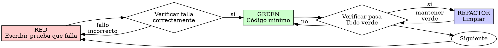

# Test-Driven Development (TDD)

## Resumen

Escribir la prueba primero. Observar que falle. Escribir código mínimo para pasar.

**Principio central:** Si no observaste que la prueba fallara, no sabes si prueba lo correcto.

**Violar la letra de las reglas es violar el espíritu de las reglas.**

## Cuándo Usar

**Siempre:**
- Nuevas características
- Correcciones de bugs
- Refactorización
- Cambios de comportamiento

**Excepciones (preguntar a tu compañero humano):**
- Prototipos desechables
- Código generado
- Archivos de configuración

¿Pensando "omitir TDD solo esta vez"? Detente. Eso es racionalización.

## La Ley de Hierro

```
NO HAY CÓDIGO DE PRODUCCIÓN SIN UNA PRUEBA QUE FALLE PRIMERO
```

¿Escribiste código antes de la prueba? Elimínalo. Empieza de nuevo.

**Sin excepciones:**
- No mantenerlo como "referencia"
- No "adaptarlo" mientras escribes pruebas
- No mirarlo
- Eliminar significa eliminar

Implementar fresco desde pruebas. Punto.

## Red-Green-Refactor



### RED - Escribir Prueba que Falla

Escribir una prueba mínima mostrando qué debería pasar.

<Bueno>
```typescript
test('reintenta operaciones fallidas 3 veces', async () => {
  let attempts = 0;
  const operation = () => {
    attempts++;
    if (attempts < 3) throw new Error('fail');
    return 'success';
  };

  const result = await retryOperation(operation);

  expect(result).toBe('success');
  expect(attempts).toBe(3);
});
```
Nombre claro, prueba comportamiento real, una cosa
</Bueno>

<Malo>
```typescript
test('retry funciona', async () => {
  const mock = jest.fn()
    .mockRejectedValueOnce(new Error())
    .mockRejectedValueOnce(new Error())
    .mockResolvedValueOnce('success');
  await retryOperation(mock);
  expect(mock).toHaveBeenCalledTimes(3);
});
```
Nombre vago, prueba mock no código
</Malo>

**Requisitos:**
- Un comportamiento
- Nombre claro
- Código real (sin mocks a menos que sea inevitable)

### Verificar RED - Observar que Falle

**OBLIGATORIO. Nunca omitir.**

```bash
npm test path/to/test.test.ts
```

Confirmar:
- La prueba falla (no errores)
- El mensaje de fallo es esperado
- Falla porque falta característica (no errores tipográficos)

**¿La prueba pasa?** Estás probando comportamiento existente. Arregla la prueba.

**¿La prueba tiene errores?** Arregla el error, re-ejecuta hasta que falle correctamente.

### GREEN - Código Mínimo

Escribir código más simple para pasar la prueba.

<Bueno>
```typescript
async function retryOperation<T>(fn: () => Promise<T>): Promise<T> {
  for (let i = 0; i < 3; i++) {
    try {
      return await fn();
    } catch (e) {
      if (i === 2) throw e;
    }
  }
  throw new Error('unreachable');
}
```
Solo lo suficiente para pasar
</Bueno>

<Malo>
```typescript
async function retryOperation<T>(
  fn: () => Promise<T>,
  options?: {
    maxRetries?: number;
    backoff?: 'linear' | 'exponential';
    onRetry?: (attempt: number) => void;
  }
): Promise<T> {
  // YAGNI
}
```
Sobre-ingeniería
</Malo>

No agregar características, refactorizar otro código o "mejorar" más allá de la prueba.

### Verificar GREEN - Observar que Pase

**OBLIGATORIO.**

```bash
npm test path/to/test.test.ts
```

Confirmar:
- La prueba pasa
- Otras pruebas aún pasan
- Salida pristina (sin errores, advertencias)

**¿La prueba falla?** Arregla código, no prueba.

**¿Otras pruebas fallan?** Arregla ahora.

### REFACTOR - Limpiar

Después de verde solo:
- Eliminar duplicación
- Mejorar nombres
- Extraer helpers

Mantener pruebas verdes. No agregar comportamiento.

### Repetir

Siguiente prueba que falla para siguiente característica.

## Buenas Pruebas

| Calidad | Bueno | Malo |
|---------|-------|------|
| **Mínimo** | Una cosa. ¿"y" en el nombre? Divídelo. | `test('valida email y dominio y espacios en blanco')` |
| **Claro** | El nombre describe comportamiento | `test('test1')` |
| **Muestra intención** | Demuestra API deseada | Oculta qué debería hacer el código |

## Por Qué el Orden Importa

**"Escribiré pruebas después para verificar que funciona"**

Las pruebas escritas después del código pasan inmediatamente. Pasar inmediatamente no prueba nada:
- Podría probar lo incorrecto
- Podría probar implementación, no comportamiento
- Podría omitir casos límite que olvidaste
- Nunca viste que atrapó el bug

Prueba-primero te fuerza a ver que la prueba falla, probando que realmente prueba algo.

**"Ya probé manualmente todos los casos límite"**

Las pruebas manuales son ad-hoc. Piensas que probaste todo pero:
- Sin registro de lo que probaste
- No puedes re-ejecutar cuando el código cambia
- Fácil olvidar casos bajo presión
- "Funcionó cuando lo probé" ≠ comprehensivo

Las pruebas automatizadas son sistemáticas. Se ejecutan de la misma manera cada vez.

**"Eliminar X horas de trabajo es desperdiciador"**

Falacia del costo hundido. El tiempo ya se fue. Tu elección ahora:
- Eliminar y reescribir con TDD (X horas más, alta confianza)
- Mantenerlo y agregar pruebas después (30 min, baja confianza, probablemente bugs)

El "desperdicio" es mantener código en el que no puedes confiar. Código funcionando sin pruebas reales es deuda técnica.

**"TDD es dogmático, ser pragmático significa adaptar"**

TDD ES pragmático:
- Encuentra bugs antes de commit (más rápido que depurar después)
- Previene regresiones (las pruebas atrapan roturas inmediatamente)
- Documenta comportamiento (las pruebas muestran cómo usar el código)
- Habilita refactorización (cambiar libremente, las pruebas atrapan roturas)

Los atajos "pragmáticos" = depurar en producción = más lento.

**"Las pruebas después logran los mismos objetivos - es espíritu no ritual"**

No. Las pruebas-después responden "¿Qué hace esto?" Las pruebas-primero responden "¿Qué debería hacer esto?"

Las pruebas-después están sesgadas por tu implementación. Pruebas lo que construiste, no lo requerido. Verificas casos límite recordados, no descubiertos.

Las pruebas-primero fuerzan descubrimiento de casos límite antes de implementar. Las pruebas-después verifican que recordaste todo (no lo hiciste).

30 minutos de pruebas después ≠ TDD. Obtienes cobertura, pierdes prueba de que las pruebas funcionan.

## Racionalizaciones Comunes

| Excusa | Realidad |
|--------|----------|
| "Demasiado simple para probar" | El código simple se rompe. La prueba toma 30 segundos. |
| "Probaré después" | Las pruebas pasando inmediatamente no prueban nada. |
| "Las pruebas después logran mismos objetivos" | Pruebas-después = "¿qué hace esto?" Pruebas-primero = "¿qué debería hacer esto?" |
| "Ya probé manualmente" | Ad-hoc ≠ sistemático. Sin registro, no se puede re-ejecutar. |
| "Eliminar X horas es desperdiciador" | Falacia del costo hundido. Mantener código no verificado es deuda técnica. |
| "Mantener como referencia, escribir pruebas primero" | Lo adaptarás. Eso es probar después. Eliminar significa eliminar. |
| "Necesito explorar primero" | Bien. Desechar exploración, comenzar con TDD. |
| "Prueba difícil = diseño poco claro" | Escucha la prueba. Difícil de probar = difícil de usar. |
| "TDD me ralentizará" | TDD más rápido que depurar. Pragmático = prueba-primero. |
| "Prueba manual más rápida" | Manual no prueba casos límite. Re-probarás cada cambio. |
| "El código existente no tiene pruebas" | Lo estás mejorando. Agregar pruebas para código existente. |

## Banderas Rojas - DETENER y Empezar de Nuevo

- Código antes de prueba
- Prueba después de implementación
- Prueba pasa inmediatamente
- No puedes explicar por qué la prueba falló
- Pruebas agregadas "después"
- Racionalizando "solo esta vez"
- "Ya lo probé manualmente"
- "Las pruebas después logran el mismo propósito"
- "Es sobre espíritu no ritual"
- "Mantener como referencia" o "adaptar código existente"
- "Ya gasté X horas, eliminar es desperdiciador"
- "TDD es dogmático, estoy siendo pragmático"
- "Esto es diferente porque..."

**Todas estas significan: Eliminar código. Empezar de nuevo con TDD.**

## Ejemplo: Corrección de Bug

**Bug:** Email vacío aceptado

**RED**
```typescript
test('rechaza email vacío', async () => {
  const result = await submitForm({ email: '' });
  expect(result.error).toBe('Email requerido');
});
```

**Verificar RED**
```bash
$ npm test
FAIL: esperado 'Email requerido', obtuvo undefined
```

**GREEN**
```typescript
function submitForm(data: FormData) {
  if (!data.email?.trim()) {
    return { error: 'Email requerido' };
  }
  // ...
}
```

**Verificar GREEN**
```bash
$ npm test
PASS
```

**REFACTOR**
Extraer validación para múltiples campos si es necesario.

## Lista de Verificación de Verificación

Antes de marcar trabajo completo:

- [ ] Cada función/método nueva tiene una prueba
- [ ] Observaste que cada prueba fallara antes de implementar
- [ ] Cada prueba falló por razón esperada (característica faltante, no error tipográfico)
- [ ] Escribiste código mínimo para pasar cada prueba
- [ ] Todas las pruebas pasan
- [ ] Salida pristina (sin errores, advertencias)
- [ ] Las pruebas usan código real (mocks solo si es inevitable)
- [ ] Casos límite y errores cubiertos

¿No puedes marcar todas las casillas? Omitiste TDD. Empieza de nuevo.

## Cuando Estás Atascado

| Problema | Solución |
|----------|----------|
| No sé cómo probar | Escribir API deseada. Escribir aserción primero. Preguntar a tu compañero humano. |
| Prueba demasiado complicada | Diseño demasiado complicado. Simplificar interfaz. |
| Debe mockear todo | Código demasiado acoplado. Usar inyección de dependencias. |
| Configuración de prueba enorme | Extraer helpers. ¿Aún complejo? Simplificar diseño. |

## Integración de Debugging

¿Bug encontrado? Escribir prueba que falla reproduciéndolo. Seguir ciclo TDD. La prueba prueba la corrección y previene regresión.

Nunca arreglar bugs sin una prueba.

## Anti-Patrones de Pruebas

Al agregar mocks o utilidades de prueba, leer @testing-anti-patterns.md para evitar trampas comunes:
- Probar comportamiento de mock en lugar de comportamiento real
- Agregar métodos solo para pruebas a clases de producción
- Mockear sin entender dependencias

## Regla Final

```
Código de producción → prueba existe y falló primero
De lo contrario → no es TDD
```

Sin excepciones sin permiso de tu compañero humano.

## Ejemplos de Uso

### Ejemplo 1: Agregar una Nueva Característica con TDD
**Situación**: Quieres agregar una función que calcula el total de un carrito de compras, pero quieres asegurarte de que funciona correctamente.

**Cómo usar esta skill**:
1. Di a Cursor: "Quiero agregar una función para calcular el total del carrito usando TDD"
2. Cursor usará esta skill para:
   - **RED**: Escribir primero una prueba que falla mostrando cómo debería funcionar la función
   - Verificar que la prueba falla por la razón correcta (la función no existe)
   - **GREEN**: Escribir el código mínimo para que la prueba pase
   - Verificar que la prueba pasa
   - **REFACTOR**: Mejorar el código si es necesario, manteniendo las pruebas verdes

**Resultado**: Una función que funciona correctamente con pruebas que garantizan su comportamiento y previenen regresiones futuras.

### Ejemplo 2: Arreglar un Bug con TDD
**Situación**: Encontraste un bug donde los usuarios pueden enviar formularios vacíos, pero quieres arreglarlo correctamente.

**Cómo usar esta skill**:
1. Di a Cursor: "Encontré un bug donde se aceptan formularios vacíos, quiero arreglarlo con TDD"
2. Cursor seguirá el ciclo:
   - **RED**: Escribir una prueba que reproduce el bug (debe fallar mostrando que el bug existe)
   - Verificar que la prueba falla mostrando el comportamiento incorrecto actual
   - **GREEN**: Escribir la corrección mínima para que la prueba pase
   - Verificar que el bug está arreglado y la prueba pasa
   - **REFACTOR**: Limpiar el código si es necesario

**Resultado**: El bug está arreglado con una prueba que previene que vuelva a aparecer en el futuro.

### Ejemplo 3: Refactorizar Código con Confianza
**Situación**: Tienes código que funciona pero está desordenado y quieres limpiarlo sin romper nada.

**Cómo usar esta skill**:
1. Di a Cursor: "Quiero refactorizar mi código pero necesito asegurarme de no romper nada"
2. Cursor implementará:
   - Primero escribir pruebas para el comportamiento actual (si no existen)
   - Asegurar que todas las pruebas pasan antes de refactorizar
   - Refactorizar el código paso a paso
   - Después de cada cambio, ejecutar las pruebas para asegurar que todo sigue funcionando
   - Las pruebas te dan confianza para hacer cambios sin miedo

**Resultado**: Código limpio y refactorizado con la seguridad de que todo sigue funcionando correctamente, gracias a las pruebas que actúan como red de seguridad.
