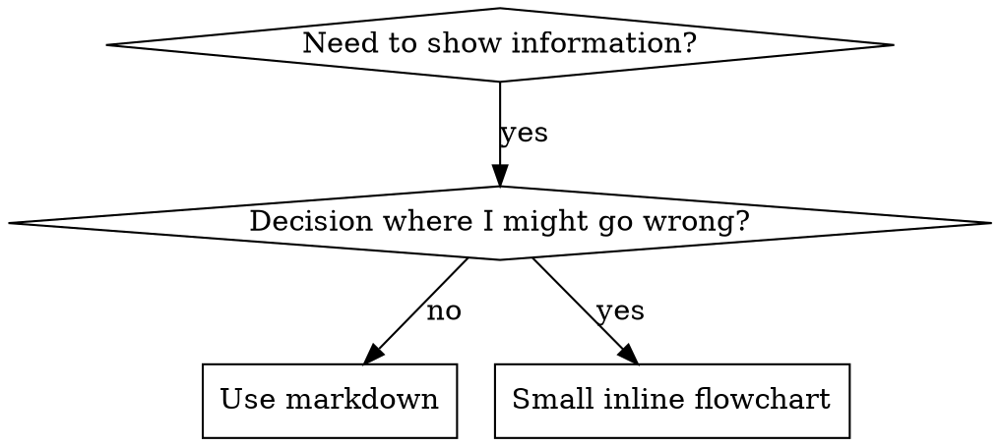

# Escribir Skills

## Resumen

**Escribir skills ES Test-Driven Development aplicado a documentación de procesos.**

**Las skills personales viven en directorios específicos del agente (`~/.claude/skills` para Claude Code, `~/.codex/skills` para Codex)**

Escribes casos de prueba (escenarios de presión con subagentes), observas que fallen (comportamiento base), escribes la skill (documentación), observas que las pruebas pasen (los agentes cumplen) y refactorizas (cierras agujeros).

**Principio fundamental:** Si no observaste que un agente fallara sin la skill, no sabes si la skill enseña lo correcto.

**ANTECEDENTES REQUERIDOS:** DEBES entender superpowers:test-driven-development antes de usar esta skill. Esa skill define el ciclo fundamental RED-GREEN-REFACTOR. Esta skill adapta TDD a documentación.

**Guía oficial:** Para las mejores prácticas oficiales de creación de skills de Anthropic, ver anthropic-best-practices.md. Este documento proporciona patrones y guías adicionales que complementan el enfoque centrado en TDD de esta skill.

## ¿Qué es una Skill?

Una **skill** es una guía de referencia para técnicas, patrones o herramientas probados. Las skills ayudan a futuras instancias de Claude a encontrar y aplicar enfoques efectivos.

**Las skills son:** Técnicas reutilizables, patrones, herramientas, guías de referencia

**Las skills NO son:** Narrativas sobre cómo resolviste un problema una vez

## Mapeo TDD para Skills

| Concepto TDD | Creación de Skill |
|--------------|-------------------|
| **Caso de prueba** | Escenario de presión con subagente |
| **Código de producción** | Documento de skill (SKILL.md) |
| **Prueba falla (RED)** | Agente viola regla sin skill (baseline) |
| **Prueba pasa (GREEN)** | Agente cumple con skill presente |
| **Refactorizar** | Cerrar agujeros manteniendo cumplimiento |
| **Escribir prueba primero** | Ejecutar escenario base ANTES de escribir skill |
| **Observar que falle** | Documentar racionalizaciones exactas que usa el agente |
| **Código mínimo** | Escribir skill abordando esas violaciones específicas |
| **Observar que pase** | Verificar que el agente ahora cumple |
| **Ciclo de refactorización** | Encontrar nuevas racionalizaciones → tapar → re-verificar |

Todo el proceso de creación de skills sigue RED-GREEN-REFACTOR.

## Cuándo Crear una Skill

**Crear cuando:**

- La técnica no era intuitivamente obvia para ti
- Referenciarías esto de nuevo en proyectos
- El patrón se aplica ampliamente (no específico del proyecto)
- Otros se beneficiarían

**No crear para:**

- Soluciones únicas
- Prácticas estándar bien documentadas en otros lugares
- Convenciones específicas del proyecto (poner en CLAUDE.md)
- Restricciones mecánicas (si es aplicable con regex/validación, automatízalo—guarda documentación para decisiones de juicio)

## Tipos de Skills

### Técnica

Método concreto con pasos a seguir (condition-based-waiting, root-cause-tracing)

### Patrón

Forma de pensar sobre problemas (flatten-with-flags, test-invariants)

### Referencia

Documentación de API, guías de sintaxis, documentación de herramientas (docs de office)

## Estructura de Directorio

```
skills/
  skill-name/
    SKILL.md              # Referencia principal (requerida)
    supporting-file.*     # Solo si es necesario
```

**Espacio de nombres plano** - todas las skills en un espacio de nombres buscable

**Archivos separados para:**

1. **Referencia pesada** (100+ líneas) - Documentación de API, sintaxis completa
2. **Herramientas reutilizables** - Scripts, utilidades, plantillas

**Mantener inline:**

- Principios y conceptos
- Patrones de código (< 50 líneas)
- Todo lo demás

## Establecer Grados Apropiados de Libertad

Coincidir el nivel de especificidad con la fragilidad y variabilidad de la tarea:

- **Alta libertad (instrucciones basadas en texto)**: Usar cuando múltiples enfoques son válidos o las decisiones dependen del contexto.
- **Libertad media (pseudocódigo o scripts con parámetros)**: Usar cuando existe un patrón preferido pero alguna variación es aceptable.
- **Baja libertad (scripts específicos, instrucciones sin contexto)**: Usar cuando las operaciones son frágiles, propensas a errores o la consistencia es crítica.

## Divulgación Progresiva

Gestionar el contexto eficientemente dividiendo información detallada en archivos separados:

1. **Metadata (name + description)**: Siempre cargado para descubrimiento.
2. **Cuerpo de SKILL.md**: Flujo de trabajo central y guía de alto nivel. Mantener bajo 500 líneas.
3. **Recursos agrupados**:
   - `scripts/`: Código/lógica determinística.
   - `references/`: Esquemas detallados, documentación de API o conocimiento de dominio.
   - `assets/`: Plantillas, imágenes o archivos estáticos.

**Patrón**: Enlazar a contenido avanzado o detalles específicos de variante (p. ej., `aws.md` vs `gcp.md`) desde el `SKILL.md` principal.

## Estructura de SKILL.md

**Frontmatter (YAML):**

- Solo dos campos soportados: `name` y `description`
- Máximo 1024 caracteres en total
- `name`: Usar solo letras, números y guiones (sin paréntesis, caracteres especiales)
- `description`: Tercera persona, describe SOLO cuándo usar (NO qué hace)
  - Comenzar con "Use when..." para enfocarse en condiciones de activación
  - Incluir síntomas específicos, situaciones y contextos
  - **NUNCA resumir el proceso o flujo de trabajo de la skill** (ver sección CSO para saber por qué)
  - Mantener bajo 500 caracteres si es posible

```markdown
---
name: Skill-Name-With-Hyphens
description: Use when [specific triggering conditions and symptoms]
---

# Skill Name

## Overview

What is this? Core principle in 1-2 sentences.

## When to Use

[Small inline flowchart IF decision non-obvious]

Bullet list with SYMPTOMS and use cases
When NOT to use

## Core Pattern (for techniques/patterns)

Before/after code comparison

## Quick Reference

Table or bullets for scanning common operations

## Implementation

Inline code for simple patterns
Link to file for heavy reference or reusable tools

## Common Mistakes

What goes wrong + fixes

## Real-World Impact (optional)

Concrete results
```

## Optimización de Búsqueda de Claude (CSO)

**Crítico para descubrimiento:** El futuro Claude necesita ENCONTRAR tu skill

### 1. Campo de Descripción Rico

**Propósito:** Claude lee la descripción para decidir qué skills cargar para una tarea dada. Haz que responda: "¿Debo leer esta skill ahora mismo?"

**Formato:** Comenzar con "Use when..." para enfocarse en condiciones de activación

**CRÍTICO: Descripción = Cuándo Usar, NO Qué Hace la Skill**

La descripción debe SOLO describir condiciones de activación. NO resumas el proceso o flujo de trabajo de la skill en la descripción.

**Por qué importa:** Las pruebas revelaron que cuando una descripción resume el flujo de trabajo de la skill, Claude puede seguir la descripción en lugar de leer el contenido completo de la skill. Una descripción que decía "code review between tasks" causó que Claude hiciera UNA revisión, aunque el diagrama de flujo de la skill claramente mostraba DOS revisiones (cumplimiento de especificación luego calidad de código).

Cuando la descripción se cambió a solo "Use when executing implementation plans with independent tasks" (sin resumen de flujo de trabajo), Claude leyó correctamente el diagrama de flujo y siguió el proceso de revisión de dos etapas.

**La trampa:** Las descripciones que resumen el flujo de trabajo crean un atajo que Claude tomará. El cuerpo de la skill se convierte en documentación que Claude omite.

```yaml
# ❌ MALO: Resume flujo de trabajo - Claude puede seguir esto en lugar de leer skill
description: Use when executing plans - dispatches subagent per task with code review between tasks

# ❌ MALO: Demasiado detalle de proceso
description: Use for TDD - write test first, watch it fail, write minimal code, refactor

# ✅ BUENO: Solo condiciones de activación, sin resumen de flujo de trabajo
description: Use when executing implementation plans with independent tasks in the current session

# ✅ BUENO: Solo condiciones de activación
description: Use when implementing any feature or bugfix, before writing implementation code
```

**Contenido:**

- Usar activadores concretos, síntomas y situaciones que señalen que esta skill aplica
- Describir el _problema_ (condiciones de carrera, comportamiento inconsistente) no _síntomas específicos del lenguaje_ (setTimeout, sleep)
- Mantener activadores agnósticos a la tecnología a menos que la skill misma sea específica de tecnología
- Si la skill es específica de tecnología, hacerlo explícito en el activador
- Escribir en tercera persona (inyectado en system prompt)
- **NUNCA resumir el proceso o flujo de trabajo de la skill**

```yaml
# ❌ MALO: Demasiado abstracto, vago, no incluye cuándo usar
description: For async testing

# ❌ MALO: Primera persona
description: I can help you with async tests when they're flaky

# ❌ MALO: Menciona tecnología pero la skill no es específica de ella
description: Use when tests use setTimeout/sleep and are flaky

# ✅ BUENO: Comienza con "Use when", describe problema, sin flujo de trabajo
description: Use when tests have race conditions, timing dependencies, or pass/fail inconsistently

# ✅ BUENO: Skill específica de tecnología con activador explícito
description: Use when using React Router and handling authentication redirects
```

### 2. Cobertura de Palabras Clave

Usar palabras que Claude buscaría:

- Mensajes de error: "Hook timed out", "ENOTEMPTY", "race condition"
- Síntomas: "flaky", "hanging", "zombie", "pollution"
- Sinónimos: "timeout/hang/freeze", "cleanup/teardown/afterEach"
- Herramientas: Comandos reales, nombres de bibliotecas, tipos de archivo

### 3. Nomenclatura Descriptiva

**Usar voz activa, verbo primero:**

- ✅ `creating-skills` no `skill-creation`
- ✅ `condition-based-waiting` no `async-test-helpers`

### 4. Eficiencia de Tokens (Crítico)

**Problema:** los flujos de trabajo getting-started y las skills frecuentemente referenciadas se cargan en CADA conversación. Cada token cuenta.

**Conteos de palabras objetivo:**

- Flujos de trabajo getting-started: <150 palabras cada uno
- Skills frecuentemente cargadas: <200 palabras en total
- Otras skills: <500 palabras (aún ser conciso)

**Técnicas:**

**Mover detalles a ayuda de herramienta:**

```bash
# ❌ MALO: Documentar todas las banderas en SKILL.md
search-conversations supports --text, --both, --after DATE, --before DATE, --limit N

# ✅ BUENO: Referenciar --help
search-conversations supports multiple modes and filters. Run --help for details.
```

**Usar referencias cruzadas:**

```markdown
# ❌ MALO: Repetir detalles de flujo de trabajo

When searching, dispatch subagent with template...
[20 líneas de instrucciones repetidas]

# ✅ BUENO: Referenciar otra skill

Always use subagents (50-100x context savings). REQUIRED: Use [other-skill-name] for workflow.
```

**Comprimir ejemplos:**

```markdown
# ❌ MALO: Ejemplo verboso (42 palabras)

your human partner: "How did we handle authentication errors in React Router before?"
You: I'll search past conversations for React Router authentication patterns.
[Dispatch subagent with search query: "React Router authentication error handling 401"]

# ✅ BUENO: Ejemplo mínimo (20 palabras)

Partner: "How did we handle auth errors in React Router?"
You: Searching...
[Dispatch subagent → synthesis]
```

**Eliminar redundancia:**

- No repetir lo que está en skills referenciadas cruzadamente
- No explicar lo que es obvio del comando
- No incluir múltiples ejemplos del mismo patrón

**Verificación:**

```bash
wc -w skills/path/SKILL.md
# flujos de trabajo getting-started: objetivo <150 cada uno
# Otras frecuentemente cargadas: objetivo <200 en total
```

**Nombrar por lo que HACES o insight central:**

- ✅ `condition-based-waiting` > `async-test-helpers`
- ✅ `using-skills` no `skill-usage`
- ✅ `flatten-with-flags` > `data-structure-refactoring`
- ✅ `root-cause-tracing` > `debugging-techniques`

**Los gerundios (-ing) funcionan bien para procesos:**

- `creating-skills`, `testing-skills`, `debugging-with-logs`
- Activo, describe la acción que estás tomando

### 4. Referencias Cruzadas a Otras Skills

**Al escribir documentación que referencia otras skills:**

Usar solo el nombre de la skill, con marcadores de requisito explícitos:

- ✅ Bueno: `**REQUIRED SUB-SKILL:** Use superpowers:test-driven-development`
- ✅ Bueno: `**REQUIRED BACKGROUND:** You MUST understand superpowers:systematic-debugging`
- ❌ Malo: `See skills/testing/test-driven-development` (no está claro si es requerido)
- ❌ Malo: `@skills/testing/test-driven-development/SKILL.md` (fuerza carga, quema contexto)

**Por qué no enlaces @:** La sintaxis `@` fuerza la carga de archivos inmediatamente, consumiendo 200k+ contexto antes de que los necesites.

## Uso de Diagramas de Flujo



**Usar diagramas de flujo SOLO para:**

- Puntos de decisión no obvios
- Bucles de proceso donde podrías detenerte demasiado temprano
- Decisiones "Cuándo usar A vs B"

**Nunca usar diagramas de flujo para:**

- Material de referencia → Tablas, listas
- Ejemplos de código → Bloques de Markdown
- Instrucciones lineales → Listas numeradas
- Etiquetas sin significado semántico (step1, helper2)

Ver @graphviz-conventions.dot para reglas de estilo de graphviz.

**Visualizando para tu compañero humano:** Usar `render-graphs.js` en este directorio para renderizar los diagramas de flujo de una skill a SVG:

```bash
./render-graphs.js ../some-skill           # Cada diagrama por separado
./render-graphs.js ../some-skill --combine # Todos los diagramas en un SVG
```

## Ejemplos de Código

**Un excelente ejemplo vence a muchos mediocres**

Elegir el lenguaje más relevante:

- Técnicas de testing → TypeScript/JavaScript
- Debugging de sistema → Shell/Python
- Procesamiento de datos → Python

**Buen ejemplo:**

- Completo y ejecutable
- Bien comentado explicando POR QUÉ
- De escenario real
- Muestra el patrón claramente
- Listo para adaptar (no plantilla genérica)

**No hacer:**

- Implementar en 5+ lenguajes
- Crear plantillas de rellenar espacios
- Escribir ejemplos artificiales

Eres bueno portando - un gran ejemplo es suficiente.

## Organización de Archivos

### Skill Autocontenida

```
defense-in-depth/
  SKILL.md    # Todo inline
```

Cuándo: Todo el contenido cabe, no se necesita referencia pesada

### Skill con Herramienta Reutilizable

```
condition-based-waiting/
  SKILL.md    # Resumen + patrones
  example.ts  # Helpers funcionales para adaptar
```

Cuándo: La herramienta es código reutilizable, no solo narrativa

### Skill con Referencia Pesada

```
pptx/
  SKILL.md       # Resumen + flujos de trabajo
  pptxgenjs.md   # 600 líneas referencia de API
  ooxml.md       # 500 líneas estructura XML
  scripts/       # Herramientas ejecutables
```

Cuándo: Material de referencia demasiado grande para inline

## La Ley de Hierro (Igual que TDD)

```
NO HAY SKILL SIN UNA PRUEBA QUE FALLE PRIMERO
```

Esto aplica a skills NUEVAS Y EDICIONES a skills existentes.

¿Escribiste skill antes de probar? Elimínala. Empieza de nuevo.
¿Editaste skill sin probar? Misma violación.

**Sin excepciones:**

- No para "adiciones simples"
- No para "solo agregar una sección"
- No para "actualizaciones de documentación"
- No mantener cambios no probados como "referencia"
- No "adaptar" mientras ejecutas pruebas
- Eliminar significa eliminar

**ANTECEDENTES REQUERIDOS:** La skill superpowers:test-driven-development explica por qué esto importa. Los mismos principios aplican a documentación.

## Probar Todos los Tipos de Skills

Diferentes tipos de skills necesitan diferentes enfoques de prueba:

### Skills que Imponen Disciplina (reglas/requisitos)

**Ejemplos:** TDD, verification-before-completion, designing-before-coding

**Probar con:**

- Preguntas académicas: ¿Entienden las reglas?
- Escenarios de presión: ¿Cumplen bajo estrés?
- Múltiples presiones combinadas: tiempo + costo hundido + agotamiento
- Identificar racionalizaciones y agregar contadores explícitos

**Criterios de éxito:** El agente sigue la regla bajo máxima presión

### Skills de Técnica (guías de cómo hacer)

**Ejemplos:** condition-based-waiting, root-cause-tracing, defensive-programming

**Probar con:**

- Escenarios de aplicación: ¿Pueden aplicar la técnica correctamente?
- Escenarios de variación: ¿Manejan casos límite?
- Pruebas de información faltante: ¿Las instrucciones tienen brechas?

**Criterios de éxito:** El agente aplica exitosamente la técnica a un nuevo escenario

### Skills de Patrón (modelos mentales)

**Ejemplos:** reducing-complexity, information-hiding concepts

**Probar con:**

- Escenarios de reconocimiento: ¿Reconocen cuándo aplica el patrón?
- Escenarios de aplicación: ¿Pueden usar el modelo mental?
- Contra-ejemplos: ¿Saben cuándo NO aplicar?

**Criterios de éxito:** El agente identifica correctamente cuándo/cómo aplicar el patrón

### Skills de Referencia (documentación/APIs)

**Ejemplos:** Documentación de API, referencias de comandos, guías de bibliotecas

**Probar con:**

- Escenarios de recuperación: ¿Pueden encontrar la información correcta?
- Escenarios de aplicación: ¿Pueden usar lo que encontraron correctamente?
- Pruebas de brechas: ¿Están cubiertos los casos de uso comunes?

**Criterios de éxito:** El agente encuentra y aplica correctamente la información de referencia

## Racionalizaciones Comunes para Omitir Pruebas

| Excusa | Realidad |
|--------|----------|
| "La skill es obviamente clara" | Clara para ti ≠ clara para otros agentes. Pruébala. |
| "Es solo una referencia" | Las referencias pueden tener brechas, secciones poco claras. Prueba recuperación. |
| "Probar es excesivo" | Las skills no probadas tienen problemas. Siempre. 15 min de prueba ahorra horas. |
| "Probaré si surgen problemas" | Problemas = agentes no pueden usar skill. Prueba ANTES de desplegar. |
| "Demasiado tedioso probar" | Probar es menos tedioso que depurar skill mala en producción. |
| "Estoy confiado de que es buena" | La sobreconfianza garantiza problemas. Prueba de todos modos. |
| "Revisión académica es suficiente" | Leer ≠ usar. Prueba escenarios de aplicación. |
| "No hay tiempo para probar" | Desplegar skill no probada desperdicia más tiempo arreglándola después. |

**Todas estas significan: Probar antes de desplegar. Sin excepciones.**

## A Prueba de Balas Skills Contra Racionalización

Las skills que imponen disciplina (como TDD) necesitan resistir la racionalización. Los agentes son inteligentes y encontrarán agujeros bajo presión.

**Nota psicológica:** Entender POR QUÉ funcionan las técnicas de persuasión ayuda a aplicarlas sistemáticamente. Ver persuasion-principles.md para fundamento de investigación (Cialdini, 2021; Meincke et al., 2025) sobre principios de autoridad, compromiso, escasez, prueba social y unidad.

### Cerrar Cada Agujero Explícitamente

No solo declarar la regla - prohibir workarounds específicos:

<Malo>
```markdown
¿Escribir código antes de prueba? Elimínalo.
```
</Malo>

<Bueno>
```markdown
¿Escribir código antes de prueba? Elimínalo. Empieza de nuevo.

**Sin excepciones:**

- No mantenerlo como "referencia"
- No "adaptarlo" mientras escribes pruebas
- No mirarlo
- Eliminar significa eliminar
```
</Bueno>

### Abordar Argumentos "Espíritu vs Letra"

Agregar principio fundamental temprano:

```markdown
**Violar la letra de las reglas es violar el espíritu de las reglas.**
```

Esto corta toda una clase de racionalizaciones "Estoy siguiendo el espíritu".

### Construir Tabla de Racionalización

Capturar racionalizaciones de pruebas base (ver sección Testing abajo). Cada excusa que hacen los agentes va en la tabla:

```markdown
| Excusa | Realidad |
|--------|----------|
| "Demasiado simple para probar" | El código simple se rompe. La prueba toma 30 segundos. |
| "Probaré después" | Las pruebas pasando inmediatamente no prueban nada. |
| "Pruebas después logran mismos objetivos" | Pruebas-después = "¿qué hace esto?" Pruebas-primero = "¿qué debería hacer esto?" |
```

### Crear Lista de Banderas Rojas

Facilitar que los agentes se auto-verifiquen cuando racionalizan:

```markdown
## Banderas Rojas - DETENER y Empezar de Nuevo

- Código antes de prueba
- "Ya lo probé manualmente"
- "Pruebas después logran el mismo propósito"
- "Es sobre espíritu no ritual"
- "Esto es diferente porque..."

**Todas estas significan: Eliminar código. Empezar de nuevo con TDD.**
```

### Actualizar CSO para Síntomas de Violación

Agregar a descripción: síntomas de cuándo estás A PUNTO de violar la regla:

```yaml
description: use when implementing any feature or bugfix, before writing implementation code
```

## RED-GREEN-REFACTOR para Skills

Seguir el ciclo TDD:

### RED: Escribir Prueba que Falla (Baseline)

Ejecutar escenario de presión con subagente SIN la skill. Documentar comportamiento exacto:

- ¿Qué decisiones tomaron?
- ¿Qué racionalizaciones usaron (textualmente)?
- ¿Qué presiones activaron violaciones?

Esto es "observar que la prueba falle" - debes ver qué hacen naturalmente los agentes antes de escribir la skill.

### GREEN: Escribir Skill Mínima

Escribir skill que aborde esas racionalizaciones específicas. No agregar contenido extra para casos hipotéticos.

Ejecutar mismos escenarios CON skill. El agente ahora debería cumplir.

### REFACTOR: Cerrar Agujeros

¿El agente encontró nueva racionalización? Agregar contador explícito. Re-probar hasta a prueba de balas.

**Metodología de prueba:** Ver @testing-skills-with-subagents.md para la metodología completa de prueba:

- Cómo escribir escenarios de presión
- Tipos de presión (tiempo, costo hundido, autoridad, agotamiento)
- Tapar agujeros sistemáticamente
- Técnicas de meta-prueba

## Anti-Patrones

### ❌ Ejemplo Narrativo

"En sesión 2025-10-03, encontramos que projectDir vacío causó..."
**Por qué es malo:** Demasiado específico, no reutilizable

### ❌ Dilución Multi-Lenguaje

example-js.js, example-py.py, example-go.go
**Por qué es malo:** Calidad mediocre, carga de mantenimiento

### ❌ Código en Diagramas de Flujo

```dot
step1 [label="import fs"];
step2 [label="read file"];
```

**Por qué es malo:** No se puede copiar-pegar, difícil de leer

### ❌ Etiquetas Genéricas

helper1, helper2, step3, pattern4
**Por qué es malo:** Las etiquetas deben tener significado semántico

## DETENER: Antes de Mover a Siguiente Skill

**Después de escribir CUALQUIER skill, DEBES DETENER y completar el proceso de despliegue.**

**NO HACER:**

- Crear múltiples skills en lote sin probar cada una
- Mover a siguiente skill antes de que la actual esté verificada
- Omitir pruebas porque "hacer lotes es más eficiente"

**La lista de verificación de despliegue abajo es OBLIGATORIA para CADA skill.**

Desplegar skills no probadas = desplegar código no probado. Es una violación de estándares de calidad.

## Lista de Verificación de Creación de Skill (TDD Adaptado)

**IMPORTANTE: Usar TodoWrite para crear todos para CADA elemento de lista de verificación abajo.**

**Fase RED - Escribir Prueba que Falla:**

- [ ] Crear escenarios de presión (3+ presiones combinadas para skills de disciplina)
- [ ] Ejecutar escenarios SIN skill - documentar comportamiento base textualmente
- [ ] Identificar patrones en racionalizaciones/fallos

**Fase GREEN - Escribir Skill Mínima:**

- [ ] Nombre usa solo letras, números, guiones (sin paréntesis/caracteres especiales)
- [ ] Frontmatter YAML con solo name y description (máx 1024 caracteres)
- [ ] Descripción comienza con "Use when..." e incluye activadores/síntomas específicos
- [ ] Descripción escrita en tercera persona
- [ ] Palabras clave a lo largo para búsqueda (errores, síntomas, herramientas)
- [ ] Resumen claro con principio central
- [ ] Abordar fallos base específicos identificados en RED
- [ ] Código inline O enlazar a archivo separado
- [ ] Un excelente ejemplo (no multi-lenguaje)
- [ ] Ejecutar escenarios CON skill - verificar que agentes ahora cumplen

**Fase REFACTOR - Cerrar Agujeros:**

- [ ] Identificar NUEVAS racionalizaciones de pruebas
- [ ] Agregar contadores explícitos (si skill de disciplina)
- [ ] Construir tabla de racionalización de todas las iteraciones de prueba
- [ ] Crear lista de banderas rojas
- [ ] Re-probar hasta a prueba de balas

**Verificaciones de Calidad:**

- [ ] Diagrama de flujo pequeño solo si decisión no obvia
- [ ] Tabla de referencia rápida
- [ ] Sección de errores comunes
- [ ] Sin narrativa de historias
- [ ] Archivos de soporte solo para herramientas o referencia pesada

**Despliegue:**

- [ ] Hacer commit de skill a git y push a tu fork (si está configurado)
- [ ] Considerar contribuir de vuelta vía PR (si es ampliamente útil)

## Flujo de Trabajo de Descubrimiento

Cómo el futuro Claude encuentra tu skill:

1. **Encuentra problema** ("las pruebas son flaky")
2. **Encuentra SKILL** (descripción coincide)
3. **Escanea resumen** (¿es esto relevante?)
4. **Lee patrones** (tabla de referencia rápida)
5. **Carga ejemplo** (solo al implementar)

**Optimizar para este flujo** - poner términos buscables temprano y a menudo.

## La Línea de Fondo

**Crear skills ES TDD para documentación de procesos.**

Misma Ley de Hierro: No hay skill sin prueba que falle primero.
Mismo ciclo: RED (baseline) → GREEN (escribir skill) → REFACTOR (cerrar agujeros).
Mismos beneficios: Mejor calidad, menos sorpresas, resultados a prueba de balas.

Si sigues TDD para código, síguelo para skills. Es la misma disciplina aplicada a documentación.

## Ejemplos de Uso

### Ejemplo 1: Crear una Skill para un Patrón que Usas Frecuentemente
**Situación**: Has notado que cada vez que necesitas validar formularios en tus proyectos, sigues el mismo proceso y quieres crear una skill para no tener que explicarlo cada vez.

**Cómo usar esta skill**:
1. Primero, di a Cursor: "Quiero crear una skill para validación de formularios, pero primero necesito probar que sin la skill, el agente no lo hace correctamente"
2. Cursor usará esta skill para:
   - Crear un escenario de prueba donde un agente intenta validar un formulario SIN la skill
   - Documentar exactamente qué hace mal o qué omite
   - Luego crear la skill que aborda esos problemas específicos
   - Probar de nuevo CON la skill para verificar que ahora funciona correctamente
   - Refinar la skill hasta que sea a prueba de balas

**Resultado**: Tienes una skill reutilizable que enseña a los agentes cómo validar formularios correctamente, probada y verificada.

### Ejemplo 2: Mejorar una Skill Existente que No Funciona Bien
**Situación**: Tienes una skill que creaste antes, pero notas que los agentes no siempre la siguen correctamente o encuentran formas de evitarla.

**Cómo usar esta skill**:
1. Di a Cursor: "Quiero mejorar mi skill de testing porque los agentes a veces la omiten"
2. Cursor seguirá el proceso RED-GREEN-REFACTOR:
   - **RED**: Probará la skill actual y documentará exactamente cómo los agentes la evitan o la malinterpretan
   - **GREEN**: Modificará la skill para cerrar esos agujeros específicos, agregando contadores explícitos a las racionalizaciones
   - **REFACTOR**: Probará de nuevo y seguirá refinando hasta que sea imposible evadirla

**Resultado**: Una skill mejorada que los agentes no pueden evitar o malinterpretar, con todos los agujeros cerrados.

### Ejemplo 3: Crear una Skill de Referencia para una API que Usas Mucho
**Situación**: Trabajas frecuentemente con una API específica (como Stripe o Supabase) y quieres una skill que contenga toda la información de referencia para que los agentes la encuentren fácilmente.

**Cómo usar esta skill**:
1. Di a Cursor: "Quiero crear una skill de referencia para la API de Stripe"
2. Cursor creará:
   - Una skill con estructura clara y palabras clave que los agentes buscarían
   - Referencias a documentación detallada en archivos separados (para no sobrecargar el contexto)
   - Ejemplos prácticos de uso común
   - Pruebas para verificar que los agentes pueden encontrar y usar la información correctamente

**Resultado**: Una skill de referencia completa que los agentes pueden encontrar fácilmente cuando trabajan con esa API, optimizada para descubrimiento y uso eficiente.
